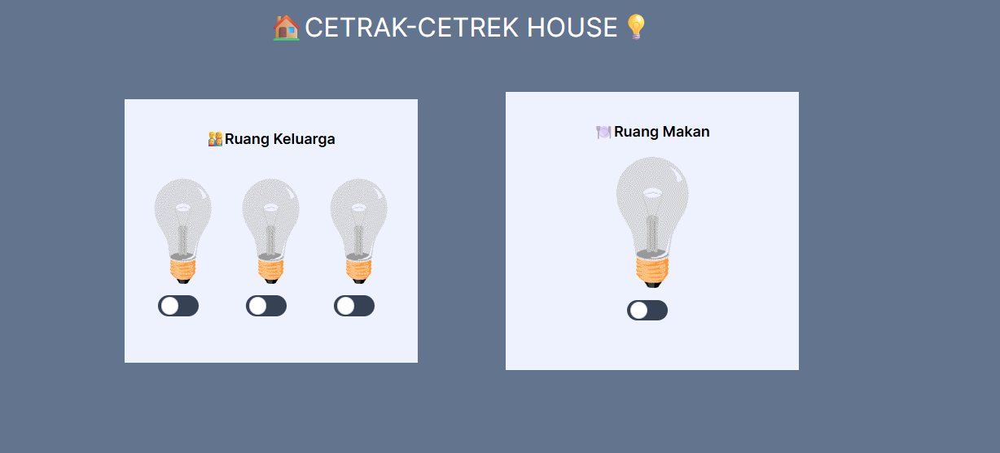

# CETRAK-CETREK-HOUSE

💡Cetrak-Cetrek is mini case study by creating a light switch game website developed using HTML, CSS with the Tailwind framework, and Javascript❤️.

This is my submission and mini task by Dea Afrizal on youtbe channel👋

For this project, there are several tasks that must be completed after learning:

1. Create additional lights, from the previous 3 lights to 10 lights.
2. The 10 lights are grouped based on the layout of a house, including🏠:
   - 🛋️ Living Room
   - 👨‍👩‍👧‍👦 Family Room
   - 🍽️ Dining Room
   - 🛏️ Bedroom

### Screenshot the result game project:

